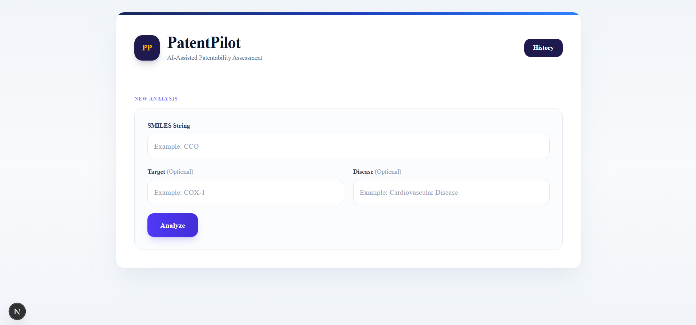
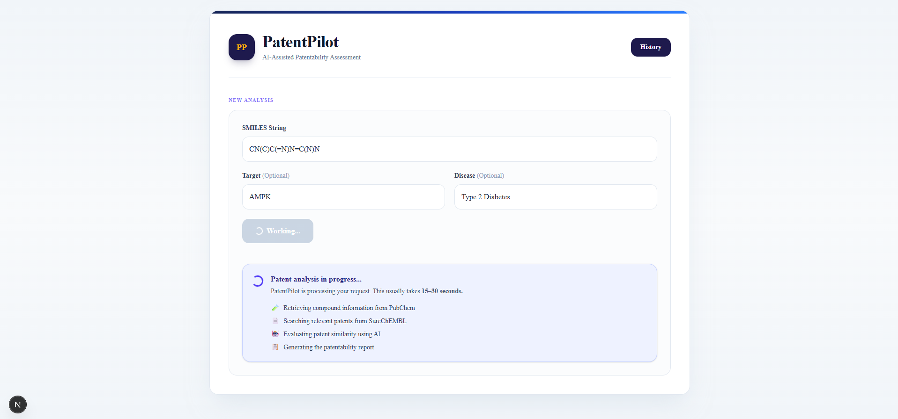
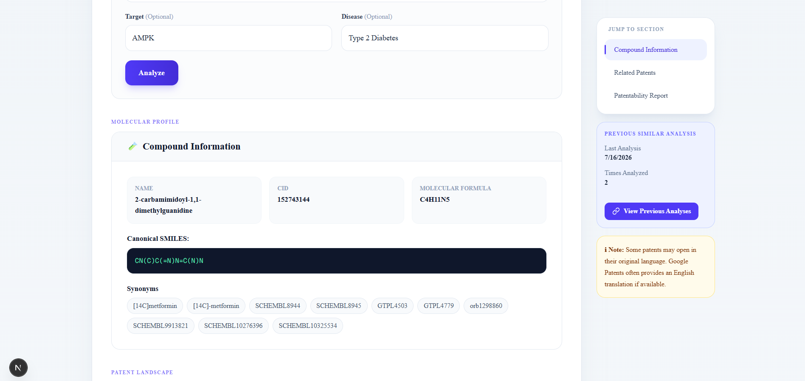
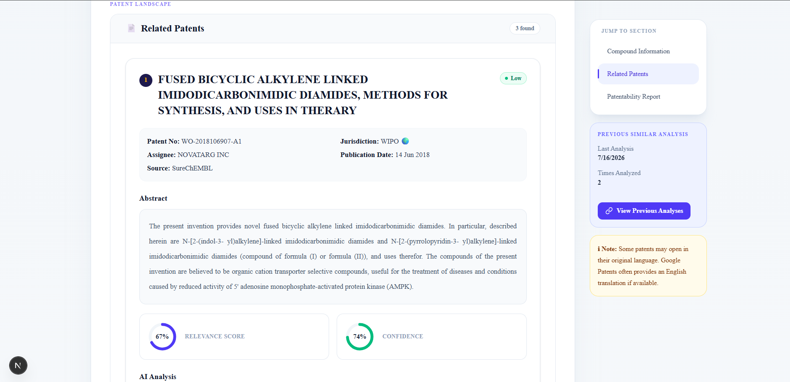
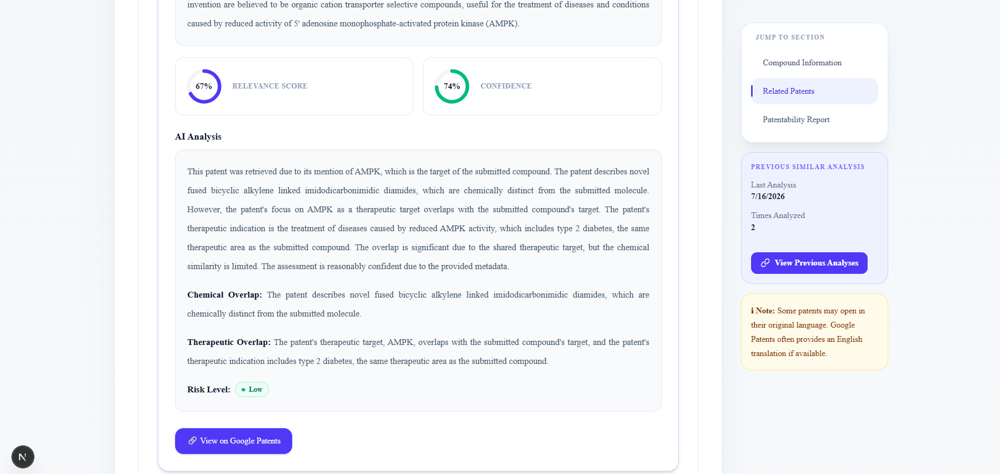
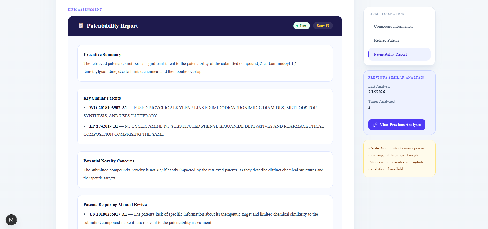
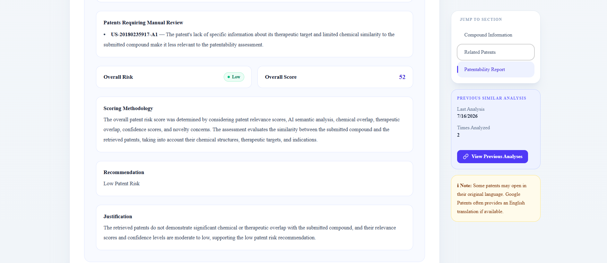
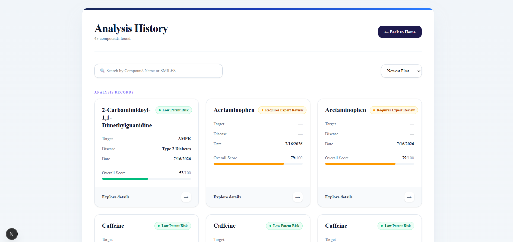
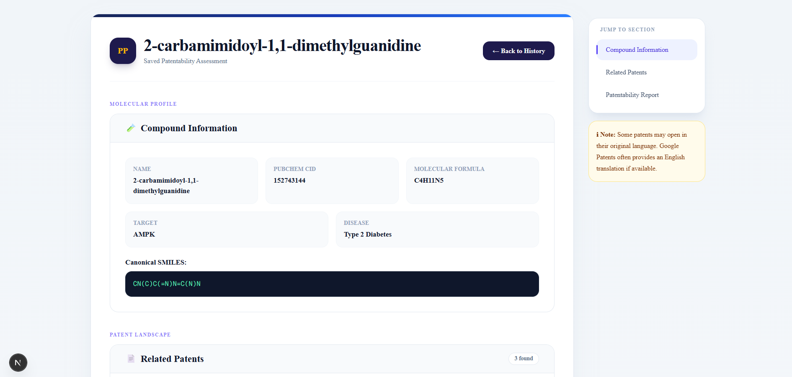

# 🧪 PatentPilot

> **AI-Assisted Patentability Assessment for Chemical Compounds**

PatentPilot is an intelligent patent search and analysis platform that helps researchers, students, and innovators perform an initial patentability assessment for chemical compounds.

Given a **SMILES string** (and optionally a biological target and disease), PatentPilot retrieves compound information, searches relevant patents from public patent databases, ranks the retrieved patents using AI-assisted analysis, and generates a comprehensive patentability report.

---

# ✨ Features

- 🔬 Analyze compounds using SMILES notation
- 🧪 Retrieve molecular information from PubChem
- 📄 Search patents from SureChEMBL
- 🤖 AI-powered patent relevance analysis
- 📊 Patentability scoring and recommendation
- 📝 AI-generated patentability report
- 📚 Analysis history with search and sorting
- 🔍 Previous similar analysis detection
- 📥 Download patentability report
- 🎨 Modern responsive user interface

---

# 📖 Table of Contents

- Overview
- System Architecture
- Project Workflow
- Retrieval Strategy
- AI Workflow
- Technologies Used
- Patent Ranking Methodology
- Assumptions
- Trade-offs
- Future Improvements
- Project Structure
- Environment Variables
- Installation
- Running the Project
- Screenshots
- License

---

# 📌 Overview

PatentPilot performs an end-to-end patentability assessment pipeline consisting of:

1. Compound validation
2. Molecular information retrieval
3. Patent retrieval
4. AI-assisted patent ranking
5. Patentability report generation
6. Historical analysis storage

Instead of merely displaying search results, PatentPilot intelligently ranks patents based on their relevance to the submitted compound and provides a structured patentability assessment.

---

# 🏗 Overall Architecture

```
                    User
                      │
                      ▼
              Next.js Frontend
                      │
                      ▼
              /api/analyze Route
                      │
                      ▼
             Analysis Pipeline
                      │
     ┌────────────────┼────────────────┐
     ▼                ▼                ▼
 PubChem API     SureChEMBL API     Groq LLM
     │                │                │
 Compound Info    Patent Search   AI Analysis
     └────────────────┼────────────────┘
                      ▼
          Patentability Assessment
                      │
                      ▼
             Supabase Database
                      │
                      ▼
          Analysis History & Reports
```

---

# 🔄 Project Workflow


## Step 1 — User Input

The user provides:

- SMILES string (**required**)
- Target (optional)
- Disease (optional)

---

## Step 2 — Compound Retrieval

PatentPilot queries the **PubChem REST API** to retrieve:

- Compound Name
- CID
- Molecular Formula
- Canonical SMILES
- Synonyms

---

## Step 3 — Patent Search

Relevant search keywords are extracted from:

- Compound name
- Molecular synonyms

These keywords are combined into a hybrid search query which is sent to the **SureChEMBL API**.

Example:

```
Compound:
Aspirin

Keywords:
aspirin
acetylsalicylic acid

Search Query:
aspirin acetylsalicylic acid
```

---

## Step 4 — Patent Ranking

Retrieved patents are analyzed using an AI model.

For every patent the AI evaluates:

- Chemical similarity
- Therapeutic overlap
- Target relevance
- Disease relevance
- Patent context

Each patent receives:

- Relevance Score
- Confidence Score
- AI Explanation

---

## Step 5 — Patentability Assessment

PatentPilot computes an overall risk score using the aggregated patent analysis.

Recommendations include:

- 🟢 Low Patent Risk
- 🟡 Requires Expert Review
- 🔴 High Patent Risk

---

## Step 6 — Report Generation

An AI-generated patentability report summarizes:

- Compound information
- Relevant patents
- AI reasoning
- Patent landscape
- Final recommendation

The report can also be downloaded.

---

## Step 7 — History Storage

Each completed analysis is stored in Supabase.

Users can later:

- Search previous analyses
- Sort history
- Reopen reports
- Detect previously analyzed compounds

---

# 🔍 Retrieval Strategy

PatentPilot uses a **Hybrid Keyword-Based Retrieval Strategy**.

Instead of relying on a single keyword, the system expands the search using:

- Compound name
- Molecular synonyms obtained from PubChem

The resulting keywords are combined into a single search query and submitted to SureChEMBL.

Example:

```
Warfarin
Coumafene

↓

warfarin Coumafene
```

This approach improves recall compared to using only the primary compound name while keeping the implementation lightweight and explainable.

---

# 🤖 AI Workflow

After patents are retrieved:

For each patent:

1. Patent metadata is extracted
2. Abstract is processed
3. Compound information is provided
4. Optional target and disease are included
5. AI evaluates patent relevance

The AI generates:

- Relevance Score
- Confidence Score
- Detailed explanation
- Chemical overlap
- Therapeutic overlap
- Risk assessment

Finally, the AI generates an overall patentability report using the combined patent analyses.

---

# 📊 Patent Ranking Methodology

PatentPilot does **not** simply display retrieved patents.

Instead, each patent is evaluated using:

- Compound similarity
- Synonym matching
- Patent abstract analysis
- Target overlap (if provided)
- Disease overlap (if provided)
- AI reasoning

The overall patentability score is calculated using aggregated relevance and confidence values across the retrieved patents.

---

# 🛠 Technologies Used

## Frontend

- Next.js 15 (App Router)
- React
- TypeScript
- Tailwind CSS

---

## Backend

- Next.js API Routes
- TypeScript

---

## Database

- Supabase

Supabase, powered by **PostgreSQL**, is used as the backend database for storing and managing:

- Analysis history
- Patentability reports
- Compound metadata
- Analysis timestamps

It enables efficient storage, retrieval, filtering, and sorting of previous analyses.

---

## External APIs

### PubChem

Retrieves:

- Compound information
- Synonyms
- Molecular properties

---

### SureChEMBL

Retrieves:

- Patent metadata
- Patent abstracts

---

### Groq LLM

Used for:

- Patent explanation
- Patent ranking
- Patentability report generation

---

# 📁 Project Structure

```
PatentPilot
│
├── app/
│   ├── api/
│   ├── history/
│   ├── report/
│   └── page.tsx
│
├── core/
│   ├── analysisPipeline.ts
│   ├── patentAnalyzer.ts
│   └── reportGenerator.ts
│
├── lib/
│
├── services/
│
├── public/
│
├── types/
│
├── .env.example
├── package.json
└── README.md
```

---

# 💡 Assumptions Made

- The submitted SMILES string represents a valid chemical structure.
- PubChem contains information for the submitted compound.
- SureChEMBL returns patents relevant to the generated keyword query.
- Patent abstracts provide sufficient context for AI evaluation.
- Optional target and disease information improve relevance but are not mandatory.

---

# ⚖ Trade-offs

## Hybrid Keyword Retrieval

Pros:

- Simple
- Explainable
- Fast
- Works well with public APIs

Cons:

- May miss patents using uncommon terminology.

---

## AI-Based Patent Ranking

Pros:

- Better contextual understanding
- Human-readable explanations
- More meaningful ranking

Cons:

- Depends on LLM quality.
- Subject to API rate limits.

---

## Public Patent Databases

Pros:

- Free
- Accessible
- Easy integration

Cons:

- Coverage may differ from commercial patent databases.

---

# 🚀 Future Improvements

- Semantic patent retrieval using embeddings
- Molecular fingerprint similarity search
- Vector database integration
- Multi-database patent search
- Interactive patent comparison
- PDF export with charts
- User authentication
- Saved projects and collections
- Batch compound analysis
- Citation graph visualization
- AI confidence calibration
- Real-time analysis progress updates
- Patent family clustering
- Prior-art timeline visualization

---

# 🔑 Environment Variables

Create a `.env.local` file.

```
GROQ_API_KEY=your_groq_api_key

NEXT_PUBLIC_SUPABASE_URL=your_supabase_project_url

NEXT_PUBLIC_SUPABASE_ANON_KEY=your_supabase_anon_key
```

See `.env.example`.

---

## Database Setup

1. Create a new Supabase project.

2. Open the SQL Editor.

3. Execute:

schema.sql

4. Copy the generated URL and anon key into:

.env.local

---

# ⚙ Installation

Clone the repository

```bash
git clone https://github.com/sreenavyach15/PatentPilot.git
```

Go into the project

```bash
cd patentpilot
```

Install dependencies

```bash
npm install
```

Create

```
.env.local
```

Add the required API keys.


---

# ▶ Running the Project

Development

```bash
npm run dev
```

Open

```
http://localhost:3000
```

Production

```bash
npm run build
npm start
```

---

# 📸 Screenshots

<p align="center">Home Page</p>



<p align="center">Extracting info</p>



<p align="center">Compound Information</p>



<p align="center">Related Patents</p>





<p align="center">Patentability Report</p>





<p align="center">Analysis History</p>



<p align="center">History of compound analysed previously</p>



